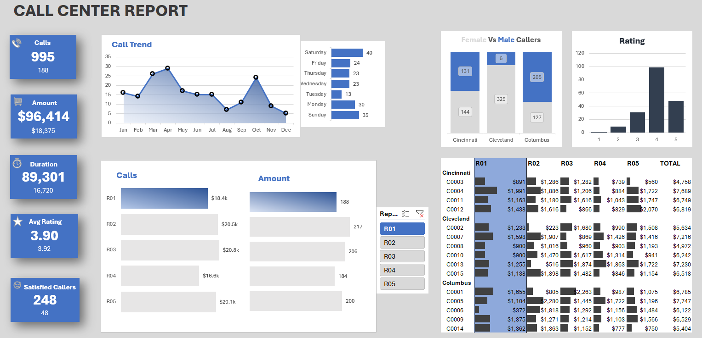

# Call-Center-Dashboard-Excel
Excel dashboard for analyzing call center performance, customer satisfaction, and sales KPIs.

# 📞 Call Center KPI Dashboard in Microsoft Excel

## Project Overview

This project is an interactive **Call Center KPI Dashboard** built entirely in **Microsoft Excel**. It demonstrates how Excel can be used for data cleaning, transformation, KPI calculation, and dashboard reporting to monitor call center performance.

The dashboard provides business insights into customer interactions, representative performance, purchase behavior, and customer satisfaction through dynamic charts, PivotTables, and Excel formulas.

---

## Objectives

* Analyze call center performance.
* Monitor customer satisfaction.
* Track representative performance.
* Identify sales and call trends.
* Build an interactive dashboard for decision-making.

---

## Dataset

The project uses call center data containing information such as:

* Call Number
* Customer ID
* Call Duration
* Representative
* Purchase Amount
* Satisfaction Rating
* Call Date

Additional analytical fields were created, including:

* Year
* Quarter
* Month
* Weekday
* Fiscal Year (FY)
* Duration Bucket
* Rounded Satisfaction Rating

---

## Workbook Structure

### 1. Raw Data

Contains the original call center dataset.

### 2. Call Table

Cleaned and transformed data formatted as an Excel Table with calculated columns for analysis.

### 3. Customer Table

Customer-related information used for reporting and analysis.

### 4. Calculations

Contains formulas used to calculate KPIs and supporting metrics.

### 5. Pivot Tables

PivotTables used to summarize call center performance.

### 6. Dashboard Portfolio

Interactive dashboard presenting key performance indicators and business insights.

### 7. Dashboard Pivots

Supporting PivotTables and PivotCharts connected to the dashboard.

---

## Excel Features Used

* Excel Tables
* Structured References
* Pivot Tables
* Pivot Charts
* Slicers
* Conditional Formatting
* Data Validation
* Named Ranges
* Dashboard Design

---

## Excel Functions Used

* SUMIFS()
* COUNTIFS()
* AVERAGEIFS()
* XLOOKUP()
* INDEX()
* MATCH()
* IF()
* IFS()
* ROUND()
* UNIQUE()
* SORT()
* FILTER()

---

## Key Performance Indicators (KPIs)

The dashboard analyzes metrics including:

* Total Calls
* Total Purchase Amount
* Average Purchase per Call
* Average Call Duration
* Average Customer Satisfaction
* Calls by Representative
* Calls by Month
* Calls by Quarter
* Calls by Weekday
* Customer Purchase Trends
* Satisfaction Rating Distribution

---

## Dashboard Features

* Interactive slicers
* Dynamic PivotCharts
* KPI cards
* Monthly trend analysis
* Representative performance comparison
* Customer satisfaction analysis
* Purchase amount analysis

---

## Skills Demonstrated

* Data Cleaning
* Data Transformation
* Business Analysis
* KPI Development
* Dashboard Design
* Data Visualization
* Excel Automation
* Analytical Reporting

---

## Tools

* Microsoft Excel
* Pivot Tables
* Pivot Charts
* Excel Formulas & Functions

---

## Repository Structure

```text
Call-Center-KPI-Dashboard/
│
├── Call_Center_KPI_Dashboard.xlsx
├── README.md
├── screenshots/
│   ├── dashboard.png
│   ├── trends.png
│   └── pivots.png
└── data/
    └── call_center_data.xlsx
```

---

## Dashboard Preview

Add screenshots of your dashboard inside the **screenshots/** folder and display them here.

Example:

```markdown

```

---

## Author

**Fodil AYADI**

